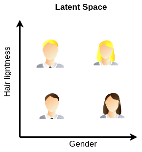
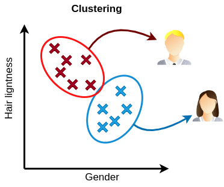
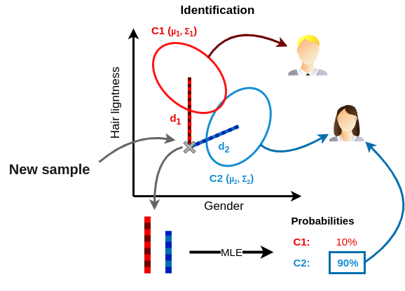

# EXIF AutoTagger 📷🏷️

## What is it?

This is a small tool that enables users to automatically detect and recognize people in their photos 📷 using , and then add the adequate tags 🏷️.

Features:

- Display photos along with their EXIF metadata.
- Add map visualization when geographical tags are available.
- Provide a database of known persons.
- Auto-detect faces in images.
- Allow the user to confirm the identities of people in a picture.
- Auto-classify detected faces and predict the corresponding persons based on a ML model.
- Can be compiled into a standalone executable (with a self contained sqlite database) for both Linux/Windows

## How does it work?

The main process that enables us to easily cluster people from their faces is the process of transforming those faces into vector embeddings using a Deep Neural Network model such as Facenet, which has been trained on thousands of different faces.

Vector embeddings are array of values produced by a model, each relating to a useful feature learned during training. \
This allows us to locate faces into a space where similarities between faces translate into spatial closeness. \

This in turn allows us to conveniently cluster together face samples for the same identified individual using the method of our choice.

In this repository, the opted for a gaussian mixture with full covariance matrix.

When given a new sample, the identity of the person corresponding to the provided space is determined according to which cluster the sample's vector embedding is more likely to belong.

There are cases where the person we try to identify is not part of the people we known. \
In such cases we would like to classify such individual as unknown. \
There are two main methods for doing this:

- Either by thresholding the likelihood of the sample belonging to any cluster.
- Or by incorporating many unknown facial profiles in the embedded space.

In this repository, we chose the second option, but maybe we will use a mix of both in the future. \
A set of 500 facial profiles from VG2 was computed into their vector embeddings and into their respective gaussian components.  

## Current limitations and planned features

## Credit

[Facenet pytorch repository](https://github.com/timesler/facenet-pytorch) \
[Pytorch](https://github.com/pytorch/pytorch) \
[Pyinstaller](https://github.com/pyinstaller/pyinstaller) \
[QT](https://github.com/qt) \
[Sqlite](https://sqlite.org/index.html)

## Author

Pierre Louvart \
[✉️ pierre.louvart@gmail.com](pierre.louvart@gmail.com) \
[🐙 https://github.com/plouvart](https://github.com/plouvart)

## License

This software is provided under the [MIT](https://opensource.org/license/mit/) license.